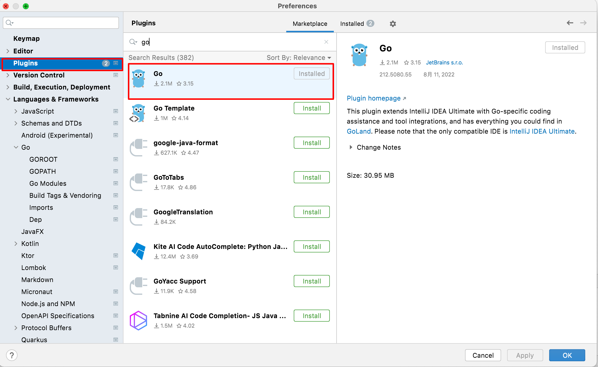

# FAQ 工程常见报错处理

## 1. java: 程序包sun.misc不存在

点击IDE左上角 File ---> Project Structure ---> Project 

设置JDK 版本为 `1.8`

## 2.如何在IDEA中配置Go工程 (IDEA 商业版本)

###  前置条件

安装 GoLang SDK >= 1.16

### 安装 Go 插件
打开IDEA，选择"Preferences"--"Plugins"，搜索`Go`，点击 "install"，重启IDEA

### 配置 GOROOT

(无需配置GOPATH!!)

### 配置 GO Modules

打开IDEA，选择"Preferences"--"Language & Frameworks"，进入到`Go`下面的GO Modules，勾选 "Enable modules integration" 保存修改。

(代码中出现红色依赖报错，请检查`Enable modules integration`是否开启)

