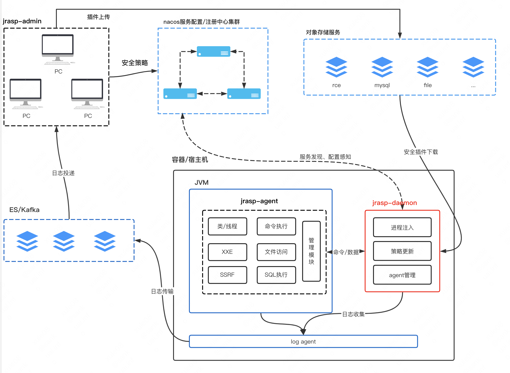

# jrasp-daemon

## 关于 jrasp-daemon
`jrasp-daemon` 是一个用户态的程序，主要是用来与Java Agent通信，对安全模块的生命周期进行控制，包括自身更新、安全 module 包更新、安全策略更新等。

jrasp-daemon 基于`Golang`构建。


## 平台兼容性

理论上，Linux、macos、windows都是兼容的，但是只有linux经过了充分测试。

为了兼容不同权限启动的Java进程注入，jrasp-daemon权限**不得低于**java进程权限，请尽量以`root`权限运行`jrasp-daemon`

## jrasp-daemon在整体架构中的位置

jrasp采用**分体式架构**, 将非必要进入业务进程的逻辑单独抽取成出独立Daemon进程，最小化对业务的侵入及资源占用, 提高系统的可用性及稳定性。
（下图红色部分）


## 需要的编译环境

* Golang >= 1.19.6 (必需)

## 单独编译 Daemon
在不同操作系统上分别提供了编译脚本，编译脚本在 jrasp-daemon/build下

进入到编译脚本路径下:
```
cd jrasp-daemon/build
```

linux/macos系统下编译：
```
./build.sh
build project start: 2022-08-06 10:06:07
current dir:/user/local/jrasp-daemon
GOPROXY:https://mirrors.aliyun.com/goproxy/
build project end: 2022-08-06 10:06:11
...
```
windows系统下编译：
```java
.\build.bat
```

### 配置守护进程(必需)

在工程的bin目录下已经写好了一个 systemctl 配置文件`jrasp-daemon.service`

守护进程的作用：jrasp-daemon 完成更新文件下载之后，立即退出，守护进程负责将新版本daemon拉起来,完成可执行文件的热更新；

## 资源占用

cpu 占用约1%左右，您无需担心性能问题。
